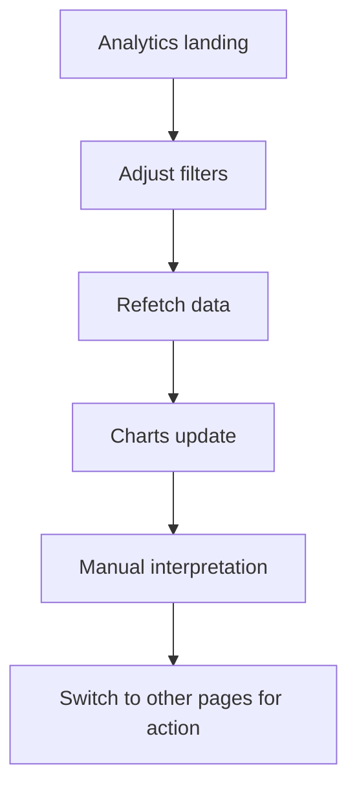
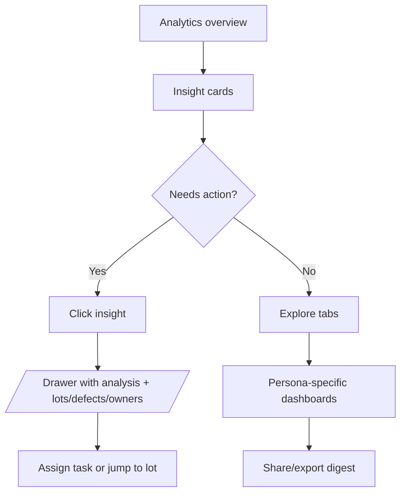

# Analytics & Insights Flow

## Current Experience

1. User lands on `/c/{tenant}/analytics` which immediately fetches four datasets (defect rate, throughput, defect types, approval time).
2. Global filters (range, group by) sit above the fold; changing them triggers full refetch and re-renders.
3. Key metrics display static `MetricCard`s; charts render with Recharts and basic loading spinners.
4. No storytelling or guided insight; users must interpret charts manually and cross-reference lots/clients.
5. Exporting insights back to stakeholders requires jumping to `/exports`.

## Pain Points

- Slow initial load with several concurrent queries; no skeleton layout or progressive hydration.
- Lack of narrative (no anomalies call-out, no comparison to targets, no natural next steps).
- Charts are static (no drilldown to lots/factories, no annotations, no share/export link).
- Mobile layout stacks charts without summarising key takeaways.
- Accessibility gaps: charts lack data table fallback or SR-friendly summaries.

## Proposed Experience

1. Introduce insight cards at top summarising anomalies (“Factory Braga defect rate +12% vs last week”) using analytics service.
2. Replace individual fetches with aggregated API (`/analytics/dashboard`) to reduce waterfalls and support streaming responses.
3. Provide drilldown interactions (click bar -> open drawer with lot list) using `Sheet` component; include quick actions.
4. Add export/share CTA inline (generate PDF snapshot) and schedule weekly digest emails.
5. For accessibility, include hidden data tables, announce key stats via ARIA live regions, and support keyboard navigation across charts.
6. Use `Tabs` for different personas (Quality, Sustainability, Operations), each with curated widgets.

## Implementation Notes

- Build analytical summariser on backend to calculate deltas vs previous period; store in cache for quick load.
- Use `Card`, `Tabs`, `Table`, and new `Button` components for consistent styling; implement skeleton placeholders.
- Consider WebGL/Canvas chart library or lighten Recharts usage; ensure responsive breakpoints.
- Integrate `ToastProvider` for saved views and `CommandMenu` entries for quick navigation (“Go to Factory insights”).
