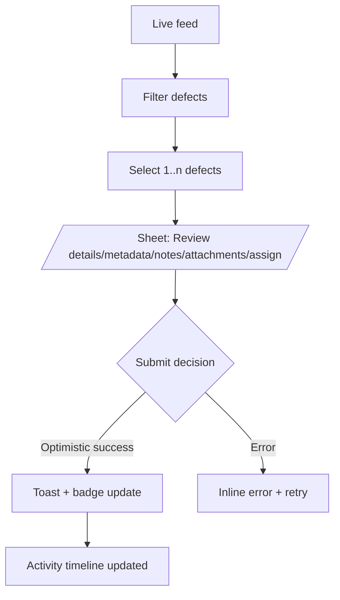

# Live Feed & Defect Review

## Current Experience

1. Landing on `/c/{tenant}/feed` shows live metrics, event banners, active sessions, pending defects, and inspection cards.
2. “Pending Defect Review” opens an inline modal (`DefectReviewModal`) with blocking overlay, manual textarea input, and `alert()` notifications for success/error.
3. Operators click “Pass/Defect” buttons on cards which trigger confirm dialogs and mutate via React Query.
4. No global status persists after review; lists refresh silently every 5–10 seconds.

```mermaid
flowchart TD
  A[Live feed] --> B[Pending defect list]
  B --> C[Select defect]
  C --> D[Modal with decision]
  D --> E{Submit}
  E -- Success --> F[alert('success')]
  E -- Error --> G[alert('error')]
  F --> H[Manual refresh via polling]
```

## Pain Points

- Blocking `alert/confirm` interrupts workflows and are inaccessible.
- Modal lacks keyboard trap, escape handling, or autosave of notes.
- No batch actions (confirm multiple defects), nor indication of who reviewed what.
- Live cards reorder every poll, creating layout shift; no filters/search.
- Mobile view overflows; modals are desktop-centric.

## Proposed Experience

1. Replace modal with drawer-based review using `Sheet` component; include image carousel, timeline, and assignee metadata.
2. Swap blocking alerts with `useToast` confirmation and optimistic updates; show inline toasts anchored bottom-right.
3. Introduce bulk actions (multi-select with sticky footer) and timeline audit (who last touched defect, timestamp).
4. Stabilise card heights with skeleton placeholders and virtualization or time-bucket grouping to reduce shift.
5. Add filters (status, factory, inspector) in a sticky toolbar and a responsive grid for mobile.
6. Provide quick actions in active sessions (“Assign reviewer”, “Jump to operator view”) using `AppShell` action slot.



## Implementation Notes

- Use new `Sheet`, `Button`, `Table` primitives for responsive review drawer.
  - Primary CTA left-aligned (“Confirm defect”), secondary right (“Mark false positive”).
- Hook into React Query’s `onMutate` to update caches before server response.
- Move polling intervals into a central hook with `websocket` support fallback to reduce redundant fetches.
- Attach analytics (`trackEvent`) when reviews complete for throughput monitoring.
