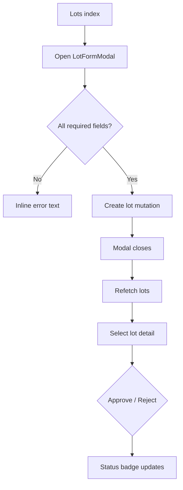

# Lot Creation & Approval Flow

## Current Experience

1. User visits `/c/{tenant}/lots` and filters tables before launching `LotFormModal` via “New Lot”.
2. Modal loads clients, factories, supply-chain roles; admins must select a client first to see factories.
3. Lot draft allows nested suppliers/roles, but UI is dense and lacks autosave; closing modal discards progress.
4. Approval happens from detail view (`/lots/{id}`) via buttons + notes; status badges update after mutation.
5. Notifications are silent (no toast), and approval timeline is fragmented across tabs.



## Pain Points

- Modal-first creation hides complexity (suppliers, CO₂ inputs) within cramped UI; no review summary.
- No autosave/draft state; accidental close loses work.
- Supply-chain role selection lacks presets or templates; repeated manual data entry.
- Approval action feels risky: no preview of impact, no confirm summary, and `alert()` usage persists in some admin flows.
- Lack of cross-team collaboration (comments, mentions, task assignment) and audit log is buried.

## Proposed Experience

1. Replace modal with multi-step “Lot Builder” route using `AppShell` layout, side progress indicator, and autosave to drafts (`/lots/new` + `/lots/{id}/edit`).
2. Introduce templates (per client/factory) for supplier stages with ability to clone, adjust CO₂ targets, and validate in-line.
3. Before submission, show review screen summarising quantities, suppliers, sustainability metrics.
4. On approval page, surface timeline + required attachments with in-context decision panel (drawer) and role-based messaging.
5. Push notifications via toast + activity feed to impacted users, and allow scheduling of approval (e.g. “Remind me in 4h”).

```mermaid
flowchart TD
  A[/lots/new] --> B[Step 1: Basic info]
  B --> C[Step 2: Suppliers & stages]
  C --> D[Step 3: CO₂ & compliance]
  D --> E[Review & submit]
  E --> F{Submit draft?}
  F -- Save draft --> G[Draft stored]
  F -- Publish --> H[Lot active]
  H --> I[Approval workspace]
  I --> J{Decision}
  J -- Approve --> K[Toast + timeline entry]
  J -- Reject --> L[Capture reason + notify]
```

## Implementation Notes

- Build dedicated routes using existing React Query mutations; draft support via `/lots/drafts` API.
- Use `Tabs`, `Card`, `Table`, `EmptyState` primitives to simplify forms and show contextual tips.
- Integrate `ToastProvider` for decision results and assignable tasks; escalate errors with inline banners.
- Extend `Lot` model with `templateId` and `draft` states; add migrations accordingly.
