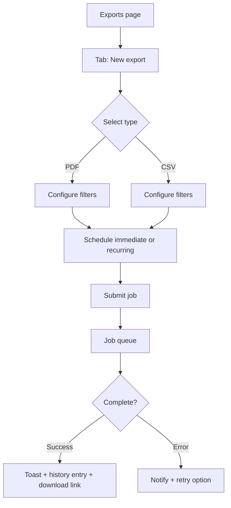

# Report & Data Export Flow

## Current Experience

1. User opens `/c/{tenant}/exports` and sees two cards (PDF report, CSV export) with range selectors and optional lot dropdown.
2. Exports trigger React Query mutations; on success `window.open` is called to download file.
3. Loading state is a spinner inside button; no confirmation toast or history view.
4. No batching—users must wait per export; there’s no scheduling or email delivery.
5. Generated files are not listed back on the page (must check MinIO/Admin).

```mermaid
flowchart TD
  A[Exports page] --> B[Select range/lot]
  B --> C[Click Generate]
  C --> D{API success?}
  D -- No --> E[Spinner stops, silent]
  D -- Yes --> F[window.open(url)]
  F --> G[Download in new tab]
```

## Pain Points

- Missing export history/status tracking; users can’t see queued/running/failed jobs.
- Download relies on pop-ups (blocked in some browsers) and lacks toast confirmation.
- Form controls are basic `<select>` components with redundant styling compared to design system.
- Cannot schedule recurring exports or combine multiple lots/ranges.
- No permission gating or warning about large CSV file size.

## Proposed Experience

1. Adopt `Table` + `Tabs` layout: “Generate new export” wizard + “History” table with statuses, retry, share links.
2. Use `Modal` or inline `Card` form with design-system `Select`, `DateRangeInput`, and `Button` components.
3. Provide asynchronous job handling with progress indicators, background polling, and toasts upon completion.
4. Allow users to choose delivery channel (download, email, SFTP) and notify when ready; incorporate email templates for stakeholders.
5. Respect `prefers-reduced-motion` with subtle skeletons and avoid pop-up windows—download via signed URL link in toast/history row.



## Implementation Notes

- Create `/exports/history` endpoint returning paginated jobs; leverage `Table` + `Pagination` primitives.
- Use `ToastProvider` for completion messages; include action button to copy download link.
- Add guardrails (file size estimate, role-based permissions) before scheduling large exports.
- Integrate email notifications via existing storage service + background worker.
